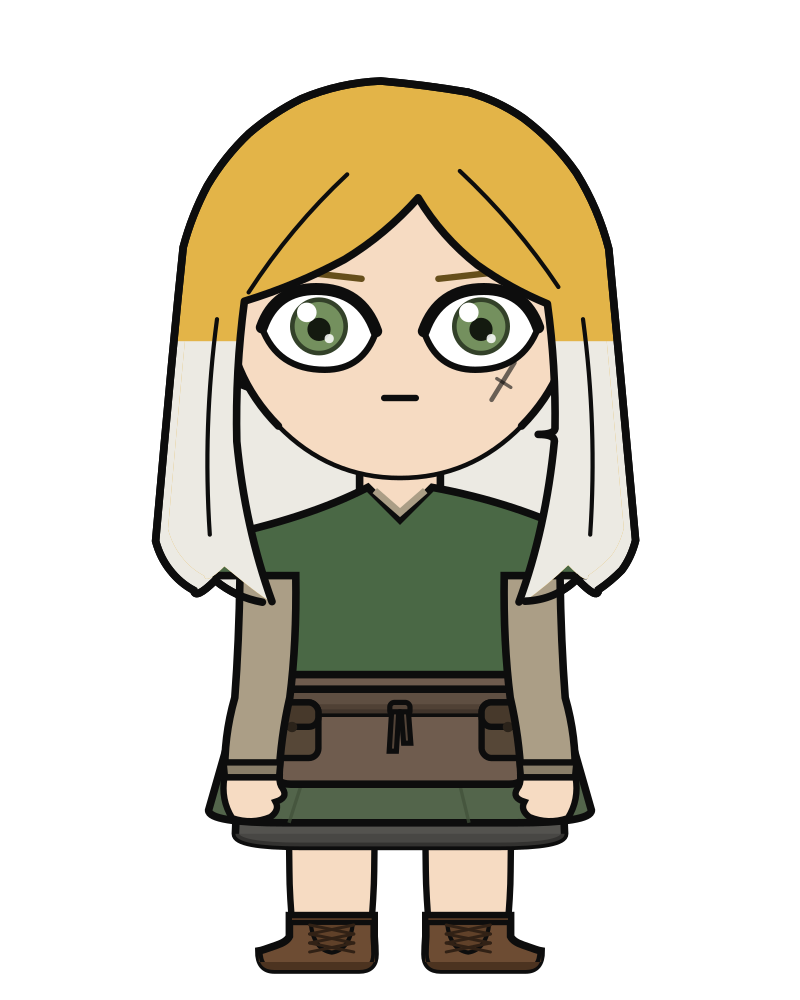
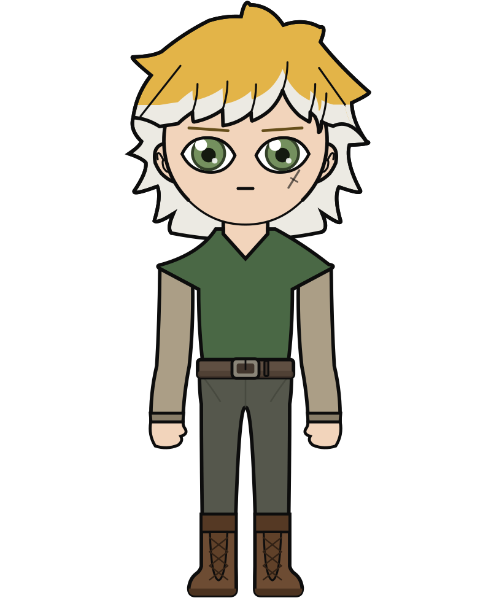
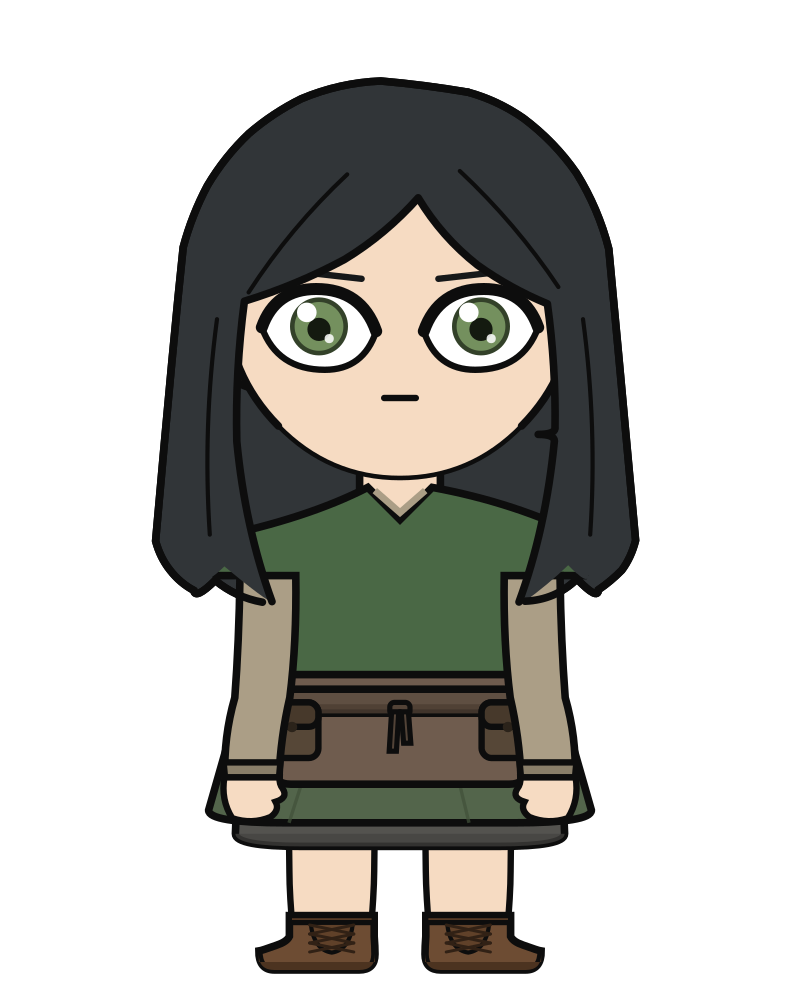
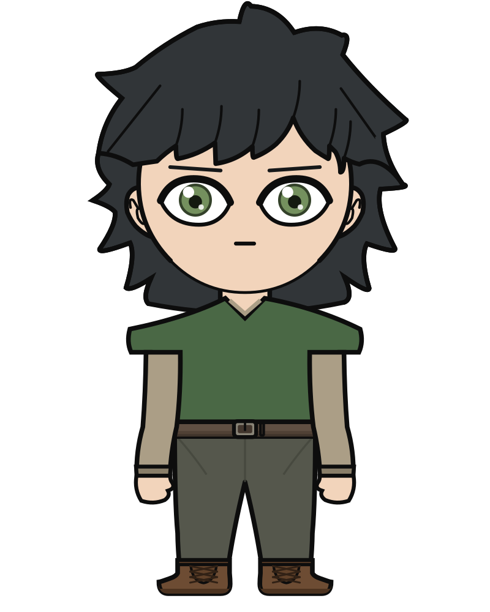

# Anime Character Creator

A 2D anime-style character creator that **draws characters
programmatically** from parametric vector shapes (SVG), rather than
compositing pre-made art. A small skeleton of proportion anchors
(head size, shoulder width, hip width, etc.) drives every shape,
hair, face, clothes, limbs, so style stays consistent by construction
instead of by curating matching assets. No AI image generation is
involved anywhere in the pipeline.

Animation is out of scope. Backgrounds and text overlays are a
possible later addition (they'd slot in as extra SVG layers).

## Status

Proof of concept: two characters, Satoko and Satoshi, each rendering at
both ends of the build range. Build is a named mode, `--build chibi`
(default) or `--build realistic`, with `--heads` open for anything in
between.

| Satoko | Satoshi | Kyoko | Tomohiro |
| --- | --- | --- | --- |
|  |  |  |  |

Those four live in `ref-out/` as both `.png` and `.svg`. **They are
transparent**, so a render drops onto a scene as it is.

They are also only two people. Kyoko is Satoko before the dye and the
burn, and Tomohiro is Satoshi the same way, so each pair is one preset
and a `replace()` of three fields rather than two sets of numbers that
happen to agree. That is deliberate: the resemblance is the point, and a
copied face keeps it only until somebody tunes an eye. See
`docs/character-roster-plan.md`.

The table is the chibi, which is the build this project publishes. The
realistic build still works on anything (`--build realistic`), but its
renders are **deferred**: the owner's call on 2026-08-08 was that the
tall figures do not work well enough yet and the chibi is where the
project is. Two of them are checked in under `ref-out/real/`, for Satoko
and Satoshi, who are the only characters whose realistic build was ever
measured against a reference. They are not displayed here.

`ref-out/cover.svg` is there too: a book cover composed around one of
them by `cover.py`, which is the same drawing code with a backdrop, mist
and a title stacked over it. That one is opaque, being a page rather than
a figure. Render it with `./cover.sh`.

The table above links `ref-out/on-white/` instead, which is the same eight
drawn on a white background. That exists for this page and nothing else:
the outline is `#0d0d0d` and a dark theme here is about `#0d1117`, so a
transparent figure on it loses its whole outer contour, which is the
hard-edged look the project is for. Reach for the transparent ones for
anything real.

Both sets are the current state of the two named characters, so they have
to be refreshed whenever a shape changes, otherwise this table shows art
the code no longer produces:

```bash
./refresh-ref-out.sh          # re-render every named character, report what moved
./refresh-ref-out.sh --check  # compare only, write nothing, exit 1 if stale
```

It renders every character in `PRESETS` at every build in `BUILDS`, so
adding a character means adding it to `presets.py` and nothing else.
Everything else generated goes to `out/`, which is not checked in.

Current shape set: head (a circle at chibi scale, narrowing to a jaw as
the build gets taller), face (eyes, brows, mouth, blush, scar), two
hairstyles that optionally divide into locks and change to a second tone
over their lower half, and a layered
outfit of tunic, undersleeves, belt, apron, skirt, underskirt, trousers
and boots, plus arms, legs and feet. All flat cel-shaded (base color plus
one shadow tone). A garment is worn when its color is set, so characters
differ by which layers they have rather than by bespoke code.

Named characters live in `presets.py`, so a character is a checked-in
artifact that gets re-rendered as the shape code improves.

Not yet built: no pose variety, no second outfit family, no picker UI.
See `STATUS.md` for what is still weak.

## Setup

```bash
uv sync            # venv, dependencies, dev tools, and this package (editable)
brew install cairo # for PNG export
```

Drawing needs nothing but the standard library: an SVG document is text.
`cairosvg` turns that text into a PNG and needs the system `cairo`
library, so it is an extra rather than a requirement. Without it,
rendering still writes a valid `.svg`, you just don't get a `.png`.

```bash
uv sync --no-dev --extra png   # just the package and PNG export
pip install anime-character-creator[png]   # or without uv, from a checkout
```

## Usage

`render.sh` is the way in. It runs the CLI from the project's own venv
with the one environment variable PNG export needs, since `cairosvg`
loads `libcairo` through `dlopen`, which on macOS doesn't look in
Homebrew's prefix.

```bash
./render.sh --out out/demo \
  --hair-color "#e8b84b" --eye-color "#4a9c6d" \
  --outfit-color "#4f7a52" --skin-tone "#f2c9a1" --boot-color "#5b4632"

./render.sh --out out/satoko --preset satoko
./render.sh --out out/satoko-tall --preset satoko --build realistic
./render.sh --out out/satoshi --preset satoshi
```

The same CLI is installed as `anime-character-creator` and as
`python -m anime_character_creator`; both skip the cairo environment
`render.sh` sets, so on macOS they write the SVG and report that PNG
export is unavailable.

`--preset` starts from a named character in `presets.py`; any flag given
alongside it overrides that one value.

Garment flags, one per layer: `--tunic-color` (also spelled
`--outfit-color`), `--undersleeve-color`, `--belt-color`,
`--apron-color`, `--skirt-color`, `--underskirt-color`,
`--trouser-color`, `--pouch-color`, `--boot-color`, plus `--skirt-length` (hip 0 to ankle
1). A layer is worn when it has a color, so these add layers; to take one
away, drop it from the preset, since the command line has no way to say
"none".

Shape flags: `--hairstyle` (`long_blunt`, `short_crop`, `short_layered`
or `short_tousled`),
`--hair-length`, `--frame` (shoulder against hip, -1 to 1, only bites at
taller builds).

Expression flags, each neutral at its default: eye shape
(`--eye-size`, `--eye-width`, `--eye-openness`, `--eye-lower-lid`,
`--eye-tilt`, `--eye-corner`, `--iris-size`), plus `--brow-tilt`, `--brow-weight`,
`--mouth-curve`, `--mouth-width`, `--blush`, `--scar-side`.

```bash
./render.sh --out out/grumpy --mouth-curve -0.6 --blush 0 --brow-tilt 0.5
```

`--expression` lays a named mood (`hollow`, `stern`, `grim`, `sorrow`,
`resolute`) over the character's resting face, changing only what the
face is *doing* and leaving what it *is* alone, so the same mood works on
any character. Individual knobs still win over it.

Add `--flat` to disable the cel-shading shadow shapes and see the flat
silhouette only. Output is written as both `.svg` (inspect/edit
directly in a browser or Inkscape) and `.png` (if cairosvg works).

**The background is transparent**, so a render drops onto a scene as it
is. Pass `--background white` (or any SVG paint) if you want it filled.

## How it works

The package lives in `src/anime_character_creator/`. Longer notes on the
machinery are in [docs/architecture.md](docs/architecture.md), and the
public surface is written up in [docs/api.md](docs/api.md).

- `skeleton.py`: `Skeleton` dataclass: head center/radius, the
  neck/shoulder/waist/hip/hem/limb widths, and the y-coordinates (neck,
  shoulder, waist, hip, hem, knee, ankle, foot) every shape positions
  itself against. The whole thing derives from `heads`, how many
  head-heights tall the figure stands, which `BUILDS` names as `chibi`
  (2.4) and `realistic` (6.0). Both the widths and where the landmarks
  sit along the body interpolate between the two: a chibi is nearly
  neckless with high hips in a short body, an adult is not. `frame`
  scales shoulder against hip on top of that, and `Skeleton.build` hands
  parts the position along the range so they don't recompute it.
  `hair_margin` is the headroom above the skull, in head radii, so hair
  has somewhere to go at a build where the head fills a third of the
  frame.
- `colorutil.py`: `shade()` derives a darker/more-saturated
  "shadow" tone from a base color, so palettes for cel-shading are
  computed, not hand-picked per shape.
- `character.py`: builds each body part as an SVG shape (paths,
  circles, capsule-strokes) positioned from the skeleton, then stacks
  them in z-order into one `<svg>` document. `CharacterParams` holds the
  colors, an `Outfit` of garments, and a `FaceStyle` of expression knobs
  (eye aperture shape, brow tilt/weight, mouth curve/width, blush, cheek
  scar); `render_character()` is the entry point. The eye is an almond
  built from four quadratics, so one set of knobs spans a tall round
  chibi eye and a narrow lidded adult one. `HAIRSTYLES` maps a name to
  the four outlines a haircut needs, plus an optional set of strands
  dividing the mass into locks, which is how a second cut gets added
  without touching the parts that draw hair.
- `presets.py`: named characters as `CharacterParams` values,
  `SATOKO` and `SATOSHI`. Reachable from the CLI via `--preset`. The two
  share a palette through module constants, since they are meant to read
  as related.
- `generate.py`: CLI: renders one character to SVG, rasterizes to
  PNG via `cairosvg` if available. Installed as the
  `anime-character-creator` command.

As a library, the whole thing is two calls:

```python
from dataclasses import replace
from pathlib import Path

from anime_character_creator import PRESETS, build_skeleton, render_character

svg = render_character(PRESETS["satoko"], build_skeleton(heads=4.0))
Path("out/satoko-mid.svg").write_text(svg)

# a variant of a named character
grumpier = replace(PRESETS["satoshi"], face=replace(PRESETS["satoshi"].face, brow_tilt=0.6))
```

## Development

```bash
uv sync                  # everything, including the dev tools
uv run pytest            # imports, renders every preset, checks ref-out/ is current
uv run ruff check .      # lint
uv run ruff format .     # format
uv run pdoc anime_character_creator -o out/apidocs   # generated API docs
```

The test suite is a smoke check, not a judge of whether a shape looks
right: that is decided by eye against `ref/`. What it catches is a broken
import, a part that stopped drawing, and a `ref-out/` that no longer
matches the code.

`CLAUDE.md` holds the rules a change to this repo has to respect, and
`STATUS.md` is the running state: what is done, what is weak, what is
next.

## Design principles

- **No pre-drawn art, no scraping.** Every pixel comes from shapes
  this code defines. This sidesteps licensing entirely and is what
  keeps every character on-model.
- **Skeleton-relative, not hardcoded coordinates.** Every shape is a
  function of `head_r` and the anchor y-values, not fixed pixels, so
  adjusting proportions (e.g. moving away from chibi later) doesn't
  require touching every shape.
- **Flat color + one shadow tone per surface**, hard-edged (no
  gradients), matches the target cel-shaded anime look and is cheap
  to render.
- **Iterate on shape, not variety, first.** Get one hairstyle/outfit
  looking right before adding a second, a shape template with wrong
  proportions is wrong for every character generated from it.
